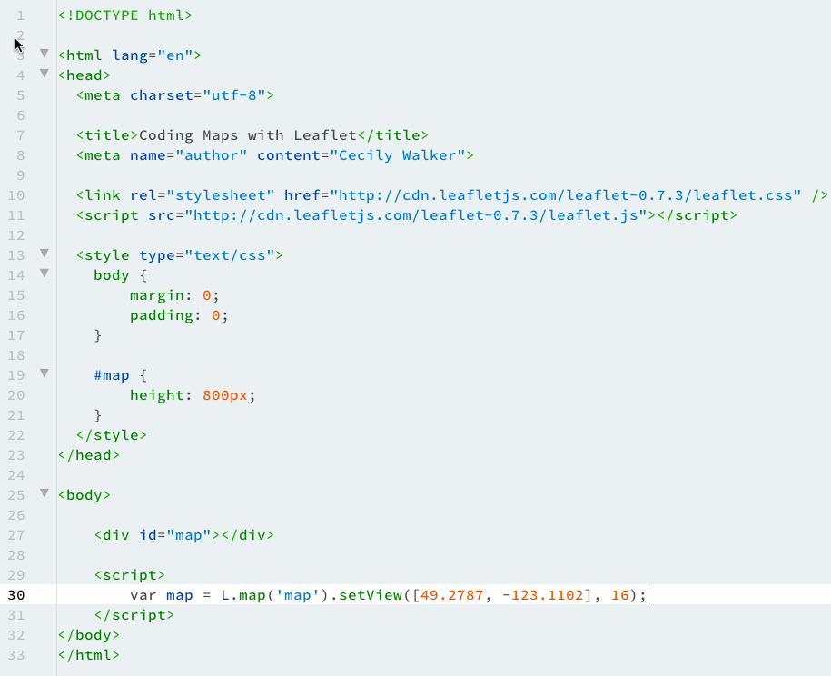

# Coding Maps with Leaflet
## Create Your HTML Page

Open your text editor. For this course, I’ll be using [Brackets](http://brackets.io "Brackets Text Editor"), but you can use whatever text editor you want. A couple of good, multi-platform ones are [Atom](http://atom.io "Atom text editor") and [Sublime Text](http://sublimetext.com "Sublime Text").

Create a new file with this basic structure:


Save the file. You can give it any name you want, as long as it ends with the **.html** extension.

## Setting up Leaflet
To make the web map work, we need to add a link to the [Leaflet CSS ](https://cdnjs.cloudflare.com/ajax/libs/leaflet/0.7.3/leaflet.css)file to the ```<head>``` section of the page. This will load a lot of predefined CSS classes and elements to your HTML page.

`<link rel="stylesheet" href="http://cdn.leafletjs.com/leaflet-0.7.3/leaflet.css" />`

Your page should look like this:


Next, add a link to the [Leaflet JavaScript file](http://cdn.leafletjs.com/leaflet-0.7.3/leaflet.js "Leaflet JavaScript library") to the ```<head>``` of your document, like this:

`<script src="http://cdn.leafletjs.com/leaflet-0.7.3/leaflet.js"></script>`

Your document should look like this:


Lastly, we need to add some of our own CSS to make the map as large or as small as we want.

Set the `margin` and `padding` on the document to `0`. Next, create a declaration for the ID `#map`, and set the `height` to `800px`.

## Add the map to your page
Next we’ll add a `div` element on the page where we want our map to appear.

In the `<body>` section of your page, add the following code:

` <div id="map"></div>`

Next, add another `<script>` tag to your page, immediately following the closing `</div>` tag.

We’ll be making a map of Vancouver, BC using OpenStreetMap. Add this code inside the `<script>` tag:

`var map = L.map('map').setView([49.2791, -123.1146], 16);`

This function sets the default view for your map using the location's latitude and longitude, and sets the map's zoom level. 

Your HTML should look like this.




## Adding map tiles
And now the fun begins - now we get to add some map tiles so that you can see your map in your web browser. 

Add the following code inside the `<script>` tag in your HTML document: 

    L.tileLayer('http://s.tile.osm.org/z/x/y.png', 
    attribution: '&copy; \<a href="http://osm.org/copyright"\>OpenStreetMap\</a\> contributors'
    }).addTo(map);
    
This looks a little complicated, so let me break it down for you. 

Essentially, this code tells Leaflet to go to OpenStreetMap, pull up some tiles from their library that match the coordinates we set in the map variable, and add those tiles to the HTML page.

Open your HTML file in your web browser. You should see a map that looks like this:

 

If you’ve come this far, give yourself a pat on the back! Next, we’ll add a map marker. 