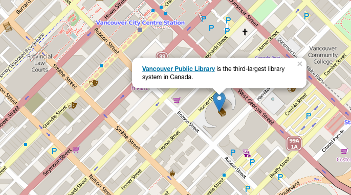

# Coding Maps with Leaflet
## Adding a Map Marker
To place a map marker, you’ll need the latitude and longitude of the exact location.

To get the latitude/longitude of an exact address, you'll need to use a Geocoding tool. OpenStreetMap has a search tool called [Nominatim](http://nominatim.openstreetmap.org) that is used to generate these coordinates.

[Latlong.net](http://www.latlong.net/convert-address-to-lat-long.html) is another useful tool that can get the latitude/longitude from a street address, and it is somewhat easier to use than Nominatim.

The latitude/longitude for Vancouver Public Library’s Central Branch is `[49.27970, -123.11562]`. Let’s place our marker here. 

Add this code inside the `<script>` tag: 

    var marker = L.marker([49.27970, -123.11549]).addTo(map);

Reload your HTML page in the browser, and you should see a blue pin on top of Vancouver Public Library. The pin won’t do anything if you click on it, so our next step is to create a popup (or tool tip) that shows some information about the library. The ability to add these popups is built into Leaflet, so creating them will be easy. 

Add this between the `<script>` tags, just after the marker variable: 

    marker.bindPopup("<b><a href='http://www.vpl.ca'>Vancouver Public Library</a></b> is the third-largest library system in Canada.");

We've emphasized "Vancouver Public Library" in the tooltip and added a link to the library's website.

Save your page, reload it in the browser, and click the marker. Your map should now look like this: 

Next, you'll learn to style your popup, and how to introduce some other interactive elements to your map.