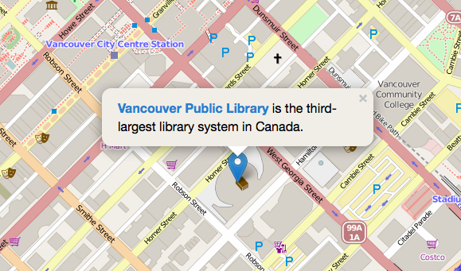
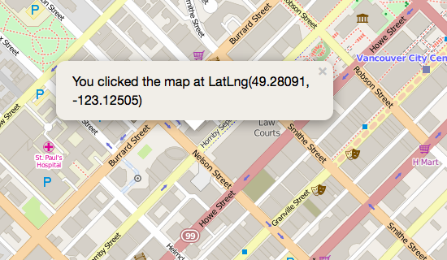

# Coding Maps with Leaflet
## Extending Your Map

### Styling Your Popup
Now that you've added your popup, let's style it. We're going to use hexadecimal (hex) colour values, but you can use RGB or RGBa colour values if you prefer. 

You'll need to find out the names of the elements you want to change. The best way to do that is to use the built in developer tools in your browser of choice. I'll be using Firefox's built in developer tools for this example. 

Open your map in Firefox. We want to inspect the pop-up, so click the push-pin to trigger the pop-up. Right click it with your mouse and choose *Inspect Element* from the menu. 

The class for the pop-up wrapper is `.leaflet-popup-content-wrapper`. You'll want to declare the class in the CSS at the head of your HTML document. We'll set the background colour to a light beige colour, and the foreground colour to black. Let's also increase the font size and line height to make the popup text a little easier to read.

     .leaflet-popup-content-wrapper {
        background: #F1EEE8;
        color: #000;
        font-size: 16px;
        line-height: 24px;
    }
    

We'll also want to change the link colour so it shows up more clearly: 

    .leaflet-popup-content-wrapper a {
        color: #2B82CB;
    }

Save your HTML document, reload it in the browser, and click the pop-up to see your changes. Your map should look like this: 

Every time something happens in Leaflet - such as a mouse click or the map zooms in and out - the corresponding object sends an event that you can describe with a function. Let's add an action that pops up a message that tells the user the latitude and longitude of any location they click on the map.

First, we'll define a variable for the popup, and then call the popup with the a map click event. Add this code to your HTML page: 

    var popup = L.popup();
        
        function onMapClick(e) {
            popup
            .setLatLng(e.latlng)
            .setContent("You clicked the map at " + e.latlng.toString())
            .openOn(map);
        }
        
        
        map.on('click', onMapClick);

Save your HTML document and reload it in the browser. To see if your function is working properly, click anywhere on the map.   

You can add many other features to your map, including circles, polygons, images, and custom pins. Some of those go beyond the scope of this tutorial, but the [Leaflet Quick Start Guide](http://leafletjs.com/examples/quick-start.html) covers them in some detail.   